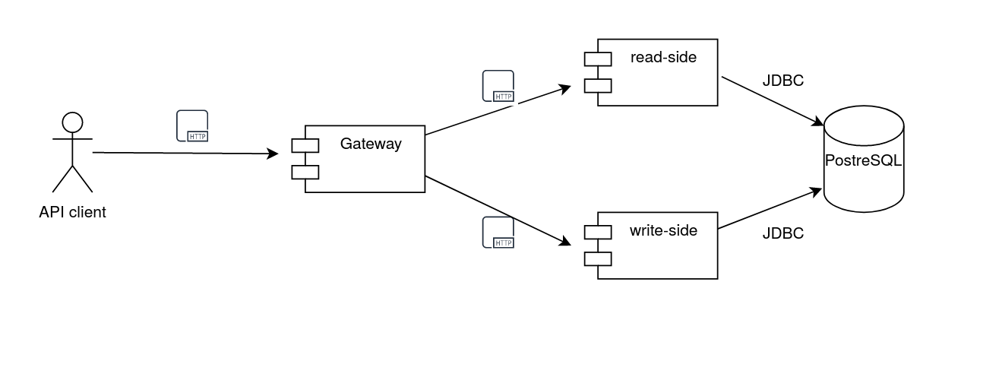

# Project Time Tracker

API for tracking time of projects. The time is tracked in tasks. Statistics are gathered per user.

## Brief architecture



System contains 3 services:
 * gateway - exposes API, handles authorization and routes request to proper services
 * read-side - contains endpoints responsible for queries
 * write-side - contains endpoints responsible for data modifications

Data are stored in PostgreSQL database. There are separate schemas in SQL databases for read-side and write-side.

## Sub-projects

 * [api](api/README.md) - REST API defined with [tAPIr](https://tapir.softwaremill.com/)
 * [gateway](gateway/README.md) - gateway exposing API with authorization
   and [OpenAPI](https://www.openapis.org/) documentation with [Swagger UI](https://swagger.io/tools/swagger-ui/)
 * [read-side](read-side/README.md) - implementation of the query (read) side of the API
 * [write-side](write-side/README.md) - implementation of command (write) side of the API
 * [e2e-tests](e2e-tests/README.md) - end to end tests

## Run

### Local database:

```
$ docker-compose -f local-dev/docker-compose.yml up -d
```

To remove docker volume to be able to start a fresh version without any data:
```
$ docker stop project-time-tracker-postgresql && docker rm project-time-tracker-postgresql && docker volume rm local-dev_project-time-tracker-postgresql-data
```

### Applications

You can run each service separately:
```
$ sbt gateway/run
$ sbt read-side/run
$ sbt write-side/run
```

You can also run them all in the background:
```
$ sbt runAll
```

### Using API

The simplest way to check, learn and experiment with the API
is by using [Swagger UI](https://swagger.io/tools/swagger-ui/) exposed by [gateway](gateway/README.md):

http://localhost:8080/docs/index.html?url=/docs/docs.yaml

Authorization is described in the [gateway](gateway/README.md).

## Running tests

To run all possible tests in all sub-projects invoke (from the main directory):
```
$ sbt checks
```
To run only unit tests:
```
$ sbt test
```
To run only integration tests (much slower than unit tests, using
[testcontainers](https://github.com/testcontainers/testcontainers-scala)):
```
$ sbt it:test
```

End to end tests are not included in `checks`, because they require running application,
see [e2e-tests](e2e-tests/README.md)) for details

## Date and time formats

Currently, all dates are stored and expected without timezone information, services assume UTC timezone. Clients
need to provide dates in UTC without time zone. Services use and expect
[ISO 8601](https://en.wikipedia.org/wiki/ISO_8601) format. Example input for task creation:
```json
{
  "startedAt": "2020-08-04T10:00:00",
  "duration": "PT4H",
  "volume": 1,
  "comment": "a new shiny task"
}
```

Note: Date and time with `Z` (e.g. `2020-01-01T10:00Z`) works in query parameters, but does not work
in JSON body.

## Libraries used

 * [http4s](https://http4s.org/) as http server in API implementation
 * [akka-http](https://doc.akka.io/docs/akka-http/current/index.html) as http server in gateway
 * [circe](https://circe.github.io/circe/) for JSON serialization
 * [ZIO](https://zio.dev/) as functional library
 * [cats](https://typelevel.org/cats/) as functional library
 * [tAPIr](https://tapir.softwaremill.com/) to describe endpoint (API)
 * [doobie](https://tpolecat.github.io/doobie/) to access SQL database
 * [quill](https://getquill.io/) to write SQL queries in Scala
 * [zio-config](https://zio.github.io/zio-config/) to parse configuration file into case class
 * [logback](http://logback.qos.ch/) for logging
 * [testcontainers](https://github.com/testcontainers/testcontainers-scala) to run database in a container in integration tests
 * [scalatest](https://www.scalatest.org/) as test framework
 * [enumeratum](https://github.com/lloydmeta/enumeratum) for enums
 * [refined](https://github.com/fthomas/refined) for type constraints in API
 * [diffx](https://github.com/softwaremill/diffx) for pretty diffs for case classes in tests
 * [scalamock](https://scalamock.org/) as mock library
